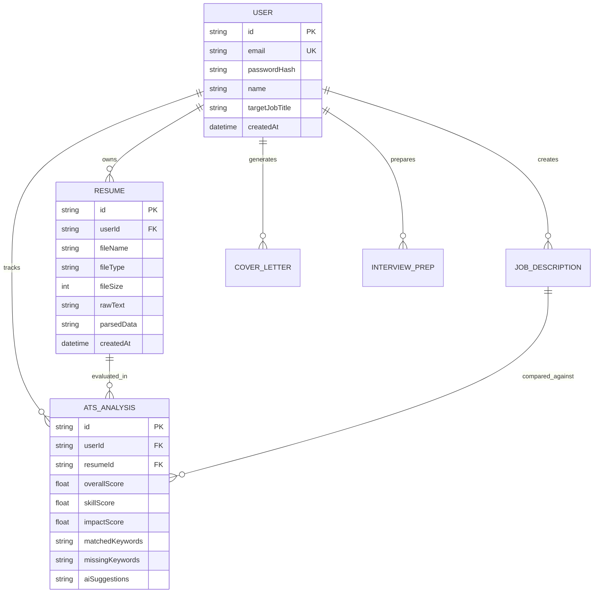

# 🚀 ResumeIQ AI — Production-Ready ATS Resume Analyzer & AI Career Suite

ResumeIQ AI is an enterprise-grade full-stack ATS (Applicant Tracking System) Resume Analyzer and AI Optimization platform. It solves the critical recruiter filtering problem by combining a **Mathematical Deterministic Heuristic Engine** with **Google Gemini Generative AI**.

---

## 🌟 Key Architecture & Capabilities

### 1. 🧮 Dual-Engine Scoring Architecture
- **Deterministic Heuristic NLP Engine (Tier 1)**:
  - 100% reproducible baseline math with **0 hallucinations**.
  - Cross-references a 600+ skills taxonomy across Frontend, Backend, Databases, Cloud/DevOps, AI/Data, and Testing.
  - TF-IDF Cosine Similarity calculation between resume text and target Job Description (JD).
  - Formula:
    $$\text{ATS Score} = 0.40 \cdot \text{Skills} + 0.25 \cdot \text{Experience} + 0.15 \cdot \text{Metrics} + 0.10 \cdot \text{Formatting} + 0.10 \cdot \text{Semantic}$$
- **Gemini Generative AI Suite (Tier 2)**:
  - Contextual resume audit & recruiter executive summary.
  - **Google XYZ Formula Bullet Rewriter** (*Accomplished [X], as measured by [Y], by doing [Z]*).
  - AI Cover Letter Synthesizer with customizable tones.
  - STAR Method Interview Preparation Flashcards.

### 2. 🛡️ In-Memory Safe Parsing Pipeline
- Multi-format ingestion (`.pdf`, `.docx`, `.doc`, `.txt`) under 5MB.
- Uses `pdf-parse` and `mammoth` with transient memory buffer processing to protect candidate Personal Identifiable Information (PII).

### 3. 📊 Analytics & Interactive Visualizations
- Real-time animated SVG `ScoreGauge` with dynamic color grading.
- Historical ATS score trajectory curves using `Recharts`.
- Domain skill distribution bar/radar visualizations.

---

## 🏗️ Folder Structure

```
resumeAI_Project/
├── client/                     # Frontend (React 18 + Vite)
│   ├── public/                 # Static assets
│   ├── src/
│   │   ├── components/         # Reusable UI components
│   │   │   ├── Navbar.jsx
│   │   │   ├── Footer.jsx
│   │   │   ├── Layout.jsx
│   │   │   ├── FileUploader.jsx
│   │   │   ├── ScoreGauge.jsx
│   │   │   ├── SkillBadge.jsx
│   │   │   ├── MetricCard.jsx
│   │   │   ├── BulletRewriterModal.jsx
│   │   │   ├── CoverLetterModal.jsx
│   │   │   └── InterviewPrepCard.jsx
│   │   ├── context/            # React Contexts
│   │   │   ├── AuthContext.jsx
│   │   │   ├── ThemeContext.jsx
│   │   │   └── ResumeContext.jsx
│   │   ├── pages/              # Application Pages
│   │   │   ├── LandingPage.jsx
│   │   │   ├── LoginPage.jsx
│   │   │   ├── RegisterPage.jsx
│   │   │   ├── AnalyzerPage.jsx
│   │   │   ├── AiStudioPage.jsx
│   │   │   ├── DashboardPage.jsx
│   │   │   ├── HistoryPage.jsx
│   │   │   └── ProfilePage.jsx
│   │   ├── services/           # Axios API services
│   │   │   ├── api.js
│   │   │   ├── authService.js
│   │   │   ├── resumeService.js
│   │   │   ├── atsService.js
│   │   │   ├── aiService.js
│   │   │   └── analyticsService.js
│   │   ├── index.css           # Design system tokens & styles
│   │   ├── App.jsx             # Router definition
│   │   └── main.jsx            # React root mount
│   └── package.json
│
├── server/                     # Backend (Node.js + Express + Prisma)
│   ├── prisma/
│   │   └── schema.prisma       # Database schema definition (SQLite / Postgres)
│   ├── src/
│   │   ├── config/             # Environment, Prisma & Gemini clients
│   │   │   ├── env.js
│   │   │   ├── prisma.js
│   │   │   └── gemini.js
│   │   ├── controllers/        # Express Route Controllers
│   │   │   ├── authController.js
│   │   │   ├── resumeController.js
│   │   │   ├── atsController.js
│   │   │   ├── aiController.js
│   │   │   └── analyticsController.js
│   │   ├── middleware/         # Auth, Upload, and Error handling
│   │   │   ├── authMiddleware.js
│   │   │   ├── uploadMiddleware.js
│   │   │   └── errorHandler.js
│   │   ├── routes/             # Express API Routes
│   │   │   ├── authRoutes.js
│   │   │   ├── resumeRoutes.js
│   │   │   ├── atsRoutes.js
│   │   │   ├── aiRoutes.js
│   │   │   └── analyticsRoutes.js
│   │   ├── services/           # Business logic & Parser services
│   │   │   ├── parserService.js
│   │   │   ├── deterministicAtsService.js
│   │   │   └── geminiService.js
│   │   ├── utils/              # NLP & Scoring mathematics
│   │   │   ├── apiResponse.js
│   │   │   ├── keywordDictionary.js
│   │   │   ├── nlpHelpers.js
│   │   │   └── scoringFormulas.js
│   │   ├── app.js              # Express app configuration
│   │   └── server.js           # Server entry point
│   └── package.json
│
└── package.json                # Root convenience scripts
```

---

## 🗄️ Database Schema & Entity Relationships



---

## 🔌 REST API Contracts

| Method | Endpoint | Description | Auth Required |
| :--- | :--- | :--- | :--- |
| `POST` | `/api/auth/register` | Register new candidate account | No |
| `POST` | `/api/auth/login` | Login & receive JWT token | No |
| `GET` | `/api/auth/me` | Fetch authenticated user profile | Yes |
| `POST` | `/api/resumes/upload` | Upload & parse PDF/DOCX file | Optional (Guest Demo supported) |
| `GET` | `/api/resumes` | Fetch user's uploaded resumes | Yes |
| `POST` | `/api/ats/analyze` | Execute Dual-Engine ATS scan | Optional |
| `GET` | `/api/ats/history` | Fetch historical ATS scans | Yes |
| `POST` | `/api/ai/rewrite-bullet`| Optimize bullet with Google XYZ | Optional |
| `POST` | `/api/ai/cover-letter` | Generate tailored cover letter | Optional |
| `POST` | `/api/ai/interview-prep`| Generate STAR interview prep | Optional |
| `GET` | `/api/analytics/dashboard`| Aggregate KPI & chart trends | Yes |

---

## ⚡ Quick Start Guide

### 1. Clone / Open Workspace
```bash
cd resumeAI_Project
```

### 2. Start Backend Server
```bash
cd server
npm install
npx prisma db push
npm run dev
```
Backend runs at: `http://localhost:5000` (Healthcheck: `http://localhost:5000/api/health`)

### 3. Start Frontend Client
```bash
cd ../client
npm install
npm run dev
```
Frontend runs at: `http://localhost:5173`

---

## 💡 Tech Interview Takeaways
- **How do you guarantee consistency in ATS scoring?**  
  *We decoupled scoring into a deterministic rule engine (TF-IDF keyword matching, regex metrics, section weights) and used the LLM solely for semantic generation and bullet point rewrites.*
- **How do you handle PDF/DOCX parsing securely?**  
  *We use Multer's in-memory storage buffer. Files are parsed on-the-fly and never written to raw unencrypted disk storage, mitigating local disk traversal and PII leakage.*
